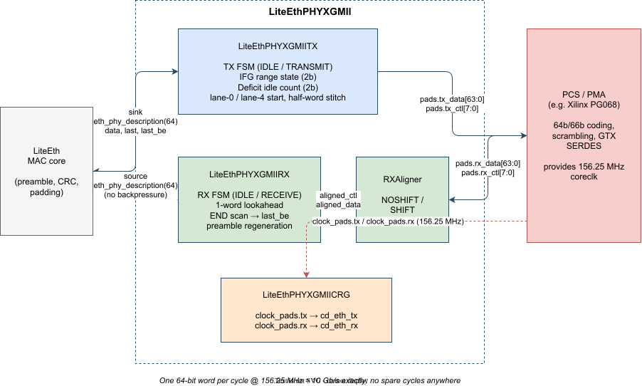
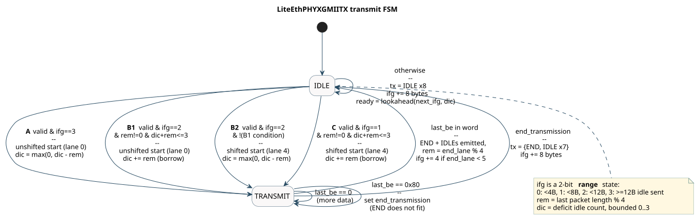
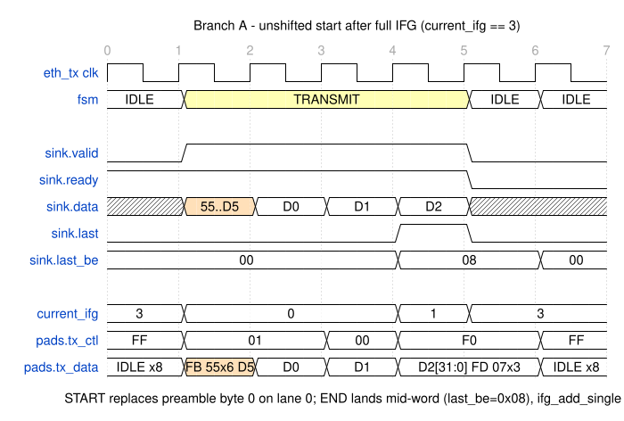
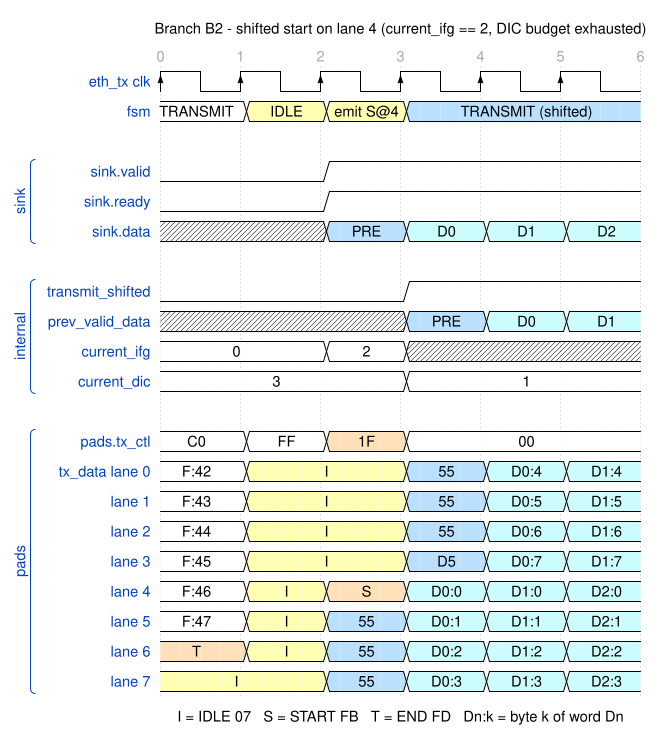
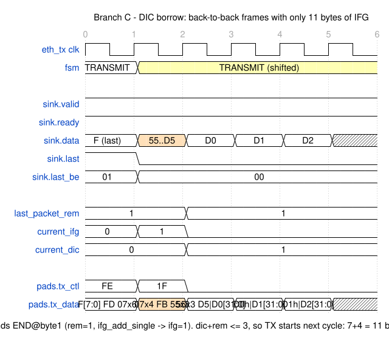
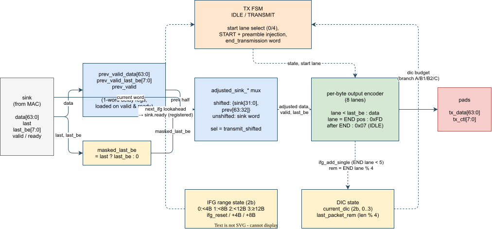
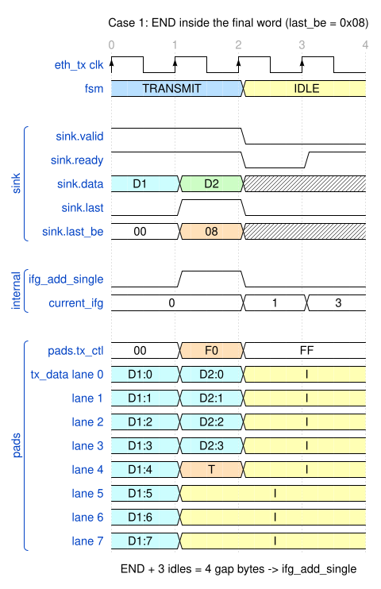
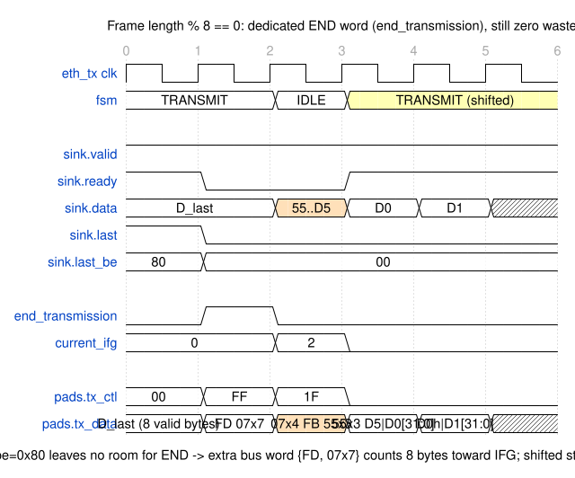
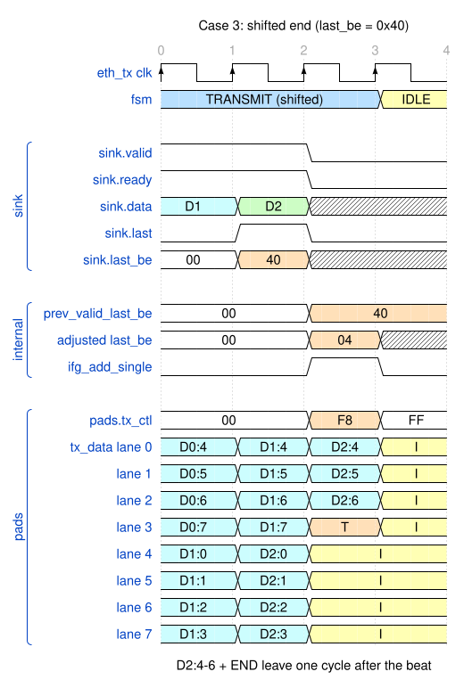
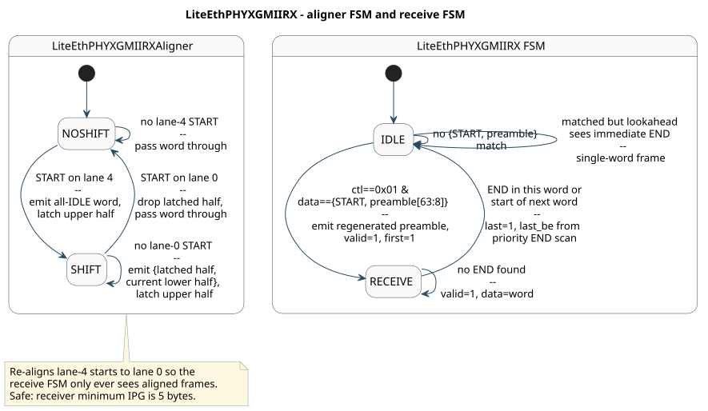

## Background

[The previous article](zc706-10g-liteeth) replaced the eval-licensed Xilinx 10G MAC on the ZC706 with LiteEth, talking to the free PG068 PCS/PMA across the XGMII boundary. I claimed there that `LiteEthPHYXGMII` "is not glue logic — it is the Reconciliation Sublayer", and promised a deep dive. This is that article.

The subject is a single file: [`liteeth/phy/xgmii.py`](https://github.com/enjoy-digital/liteeth/blob/master/liteeth/phy/xgmii.py), about 700 lines of Migen by Leon Schuermann. It converts between LiteX's generic byte stream and the 64-bit XGMII bus that every 10G PCS/PMA understands — and in doing so it implements the parts of IEEE 802.3 Clause 46 that most tutorials wave away: inter-frame gap enforcement, start-lane alignment, and the deficit idle count.

Why care about the internals? Two reasons. First, if you connect any PCS/PMA-only IP (PG068, or another vendor's equivalent), this module *is* your compliance layer — when something on the wire looks wrong, this is where you debug. Second, it is a beautifully compact case study in designing for a datapath with **zero slack**:

> 156.25 MHz × 64 bits = 10 Gb/s — exactly line rate. Every bus word matters; one wasted cycle per packet is bandwidth you never get back, and one missing cycle on RX is a lost frame.

Almost every design decision in this file falls out of that single constraint.

---

## What Clause 46 actually asks of a transmitter

XGMII itself is trivial: 64 data bits plus 8 control bits per cycle, one control bit per byte. When `ctl[i]=1`, byte `i` is a control character — `0x07` IDLE, `0xFB` START, `0xFD` END (here as seen in the 64-bit clock-domain form; on a DDR 32-bit XGMII these are two transfers). The hard part is the *protocol* the Reconciliation Sublayer must speak over it:

| Clause 46 requirement | Where it lives in `xgmii.py` |
|---|---|
| START character may only occupy **lane 0** — byte 0 or byte 4 of a 64-bit word | the unshifted/shifted start paths in the TX FSM |
| START replaces the first preamble byte; END follows the last frame byte | `unshifted_idle_transmit`, the per-byte TRANSMIT encoder |
| Inter-frame gap of ≥ 96 bit-times (12 bytes)… | `current_ifg` range tracker |
| …on **average** — the deficit idle count (46.3.1.4) may shorten individual gaps | `current_dic` / `last_packet_rem` |
| RX must tolerate starts on either lane | `LiteEthPHYXGMIIRXAligner` |

The lane-0 rule is what creates all the complexity. A frame whose length is not a multiple of 4 cannot be followed by *exactly* 12 idle bytes and still have the next frame start on a legal lane — you either pad the gap (wasting bandwidth) or borrow against the deficit idle count. Everything interesting in the TX path is machinery for making that choice every single cycle.

---

## The module at a glance



`LiteEthPHYXGMII` bundles four pieces:

- **`LiteEthPHYXGMIITX`** — stream in, XGMII out. Owns the IFG state, the DIC, and a two-state FSM (`IDLE`/`TRANSMIT`).
- **`LiteEthPHYXGMIIRX`** — XGMII in, stream out. A realigner, a one-word lookahead, and a two-state FSM (`IDLE`/`RECEIVE`).
- **`LiteEthPHYXGMIIRXAligner`** — normalises lane-4 starts to lane 0 so the RX FSM only ever sees aligned frames.
- **`LiteEthPHYXGMIICRG`** — clocks `eth_tx`/`eth_rx` from the PCS/PMA's recovered clocks (or the sim clock in model mode).

One consequence worth flagging early: the PHY sets `self.integrated_ifg_inserter = True`, and `LiteEthMACCore` checks that flag and **skips its own gap inserter** on TX (`liteeth/mac/core.py`). Gap management has to live here, in the PHY's clock domain, because only the RS knows about lanes and the DIC. If you ever wonder why the usual `LiteEthMACGap` module is missing from a 64-bit XGMII build — this is why.

The stream interface on both sides is `eth_phy_description(64)`: `data[64]`, `last`, and `last_be[8]` — a one-hot marker for the last valid byte of the frame (`0x01` = only byte 0 valid, `0x80` = all eight valid). The TX is hard-wired to `dw=64`; an `assert` at the top makes sure.

### A note on the preamble before reading any hex

LiteEth defines `eth_preamble = 0xd555555555555555`, and that is exactly the value you see in a waveform — seven `0x55` octets and the SFD `0xD5`. The 64-bit word is little-endian: byte 0 (`0x55`) is `tx_data[7:0]` and is transmitted first; the SFD sits in the top byte and goes out last. These *are* the textbook octet values. IEEE 802.3 writes the preamble bits as `10101010` and the SFD as `10101011` in transmission order, and since Ethernet serialises each octet LSB-first, those bit strings are the hex bytes `0x55` and `0xD5`. (Reading the transmission-order bit string as MSB-first hex gives the common `0xAA`/`0xAB` misquote — that notation never appears on the bus.) On the XGMII bus itself there is one further twist, covered below: the TX FSM overwrites byte 0 with the START control character, so the unshifted start word is `0xD5555555555555FB` with `tx_ctl = 0x01`.

---

## TX, part 1 — the inter-frame gap is a range, not a number

Start with the physical shape of one 64-bit XGMII cycle:

```text
lane:   0     1     2     3     4     5     6     7
byte:  low -------------------------------------- high
```

The START character may only appear on lane 0 or lane 4. That means the transmitter never needs to ask "do I have exactly 10 bytes of gap?" in isolation. It only needs to ask "if I start at the next legal slot, will the gap be safe?"

So LiteEth tracks the IFG in four buckets instead of counting exact bytes:

```python
# - 0: less than  4 bytes of IFG transmitted
# - 1: less than  8 bytes of IFG transmitted
# - 2: less than 12 bytes of IFG transmitted
# - 3: 12 or more bytes of IFG transmitted
current_ifg = Signal(max=4, reset=3)
```

Read those values as:

| `current_ifg` | Meaning | Useful consequence |
|---|---|---|
| `0` | less than 4 bytes | cannot start yet |
| `1` | 4-7 bytes | can only start early with DIC, and only on lane 4 |
| `2` | 8-11 bytes | can start on lane 4 safely, or start on lane 0 by borrowing DIC |
| `3` | 12+ bytes | can start normally on lane 0 |

Three strobe signals mutate the bucket: `ifg_reset` when a new transmission starts, `ifg_add_single` for a 4-byte step, and `ifg_add_double` for an 8-byte step. The next bucket is also computed combinationally as `next_ifg` before being registered. That lookahead is what lets the FSM decide `sink.ready` for the following cycle without ever stalling: by the time the next data word could arrive, the module already knows which start branch it would take.

A detail that surprises people: the END character **counts toward the IFG** (the START does not). So if END lands on lane 1, lanes 1 through 7 have already banked 7 IFG bytes by the end of that same cycle.

---

## TX, part 2 — the deficit idle count

The deficit idle count is easier to read as a small debt counter.

Ethernet wants a 12-byte inter-frame gap. But because START can only land on lane 0 or lane 4, some frame endings cannot be followed by exactly 12 bytes of gap. For example, if END lands on lane 1:

```text
lane:   0      1      2     3     4     5     6     7
send:  DATA   END    IDLE  IDLE  IDLE  IDLE  IDLE  IDLE
              ^^^^^^^^^^^^^^^^^^^^^^^^^^^^^^^^^^^^^^^^^^^
              7 bytes of IFG already counted
```

Where can the next frame start? Lane 0 of the very next word is hopeless — it would give only a 7-byte gap, below even the shortest gap the standard ever tolerates. The earliest slot worth considering is lane 4 of the very next word, and taking it adds the four IDLE bytes on lanes 0–3:

```text
lane:   0     1     2     3     4      5    6    7
send:  IDLE  IDLE  IDLE  IDLE  START  55   55   55
       ^^^^^^^^^^^^^^^^^^
       4 more IFG bytes
```

Total gap: `7 + 4 = 11` bytes. That is one byte short of 12.

Clause 46.3.1.4 allows this, as long as the transmitter remembers the missing byte and pays it back later. That memory is the **deficit idle count**:

LiteEth implements it as the code comment's "bounded counter of deleted XGMII idle characters":

```python
last_packet_rem = Signal(max=4)              # how many IFG bytes this frame may borrow
current_dic     = Signal(max=4, reset=3)     # current debt, bounded 0..3
```

Why does `last_packet_rem` need to exist as its own register? Because of *when* the borrow decision is made. It is not made when a frame ends — it is made when the **next** frame wants to start, possibly many idle cycles later, in the IDLE state. By then the ending beat and its `last_be` are long gone off the stream interface, so the one fact about the previous frame that still matters — how misaligned its ending was — must be latched at frame end and carried forward. That's `last_packet_rem`. And the remainder can't simply be folded into `current_dic` at frame end, because at that moment the *sign* of the update is still unknown: the same value gets added to the debt if the next frame starts early, subtracted if it starts late, and discarded entirely if the line idles long enough to clear the debt — and which of the three happens depends on when the next frame arrives. So the two signals play different roles: `current_dic` is the running balance across many frames, while `last_packet_rem` is the pending transaction held in escrow until the next start decides its sign.

Every row of the table below asks the question the lane-1 example just answered: *if the next frame starts at the earliest legal slot — lane 4 of the very next word — how many bytes short of 12 is the gap?* That shortfall is exactly the debt an early start would create, and `last_packet_rem` is where it's recorded:

| END lane | IFG banked in the END word | Gap with a lane-4 START in the next word | Bytes short of 12 | `last_packet_rem` |
|---|---:|---:|---:|---:|
| 1 | 7 | 7 + 4 = 11 | 1 | 1 |
| 2 | 6 | 6 + 4 = 10 | 2 | 2 |
| 3 | 5 | 5 + 4 = 9 | 3 | 3 |
| 4 | 4 | 4 + 4 = 8 | 4 | 0 — borrowing not allowed |

Why only four rows, when END can land on any of eight lanes? Think like the hardware. START may only sit on a 4-byte mark, so after a frame ends, idle is dispensed in chunks of 4: take the earliest slot, or wait one more slot (+4 bytes), or another (+4 more). The transmitter chooses the gap's *length* in steps of 4 — it never gets to choose its *alignment*. That was fixed the instant END landed: how many bytes past the nearest 4-byte mark it sits, the same unaligned-tail situation as on any 32-bit bus. Each tail locks the gap onto one ladder:

- **0 bytes past a mark** (lane 0 or 4): reachable gaps 12, 16, … — a clean 12 is on the ladder, nothing to borrow.
- **1 byte past** (lane 1 or 5): gaps 11, 15, … — always 1 short of clean; borrow 1 now or wait 4 extra.
- **2 bytes past** (lane 2 or 6): gaps 10, 14, … — always 2 short.
- **3 bytes past** (lane 3 or 7): gaps 9, 13, … — always 3 short.

Eight lanes, four alignments, four rows. Lane 5 is the same case as lane 1 — both sit one byte past a mark — the only difference is whether the next START lands on lane 4 or lane 0, and the FSM's branch select decides that anyway. The table uses lanes 1–4 as the representatives because those are the cases where the start fits in the very next word, matching the example above. (The second column is just `8 − lane`: END on lane *k* leaves lanes *k*–7 as gap bytes in the same word.)

The last row is the punchline, ruled out twice over: a 4-byte deficit doesn't fit in a counter bounded to 0–3, and an 8-byte gap is below the 9-byte minimum that Clause 46 permits even with maximal borrowing. A frame whose length is a multiple of 4 simply has nothing to borrow — `last_packet_rem = 0` means "this frame ends cleanly on a 4-byte boundary; no deficit arithmetic applies", and the transmitter waits for the next slot like any well-rested citizen.

The update rules in the code are then just debt accounting:

- **Start early:** `current_dic += last_packet_rem`. This is only legal while `current_dic + last_packet_rem <= 3`.
- **Start late:** `current_dic = max(0, current_dic - last_packet_rem)`. The extra idle bytes pay old debt down. **(This line is wrong — see the callout below.)**
- **Stay idle after a full gap:** `current_dic = 0`. If no packet is waiting, the transmitter has waited long enough to clear the debt completely.

The reset value of 3 is the conservative corner: at power-up the counter pretends the deficit is already maxed out, so the very first frame can never shorten its gap.

> [!warning] LiteEth's DIC drifts from the algorithm it cites — a real conformance bug
> Writing this section, I noticed the "start late" rule doesn't actually match the UNH-IOL table reproduced in the module's own comments, so I simulated the RTL to be sure. It deviates.
>
> The deficit counts *idles deleted minus idles inserted*. The "start early" rule is right: a short gap deletes `rem` idles, so `current_dic += rem`. But on a **long** gap the transmitter physically inserts `4 − rem` surplus idle bytes, while the code credits the counter by only `rem`:
>
> ```python
> NextValue(current_dic, current_dic - last_packet_rem)   # should be -(4 − rem)
> ```
>
> The two amounts are equal only when `rem == 2`, which is why that case escapes. Driving `LiteEthPHYXGMIITX` with a sustained stream of equal-length frames (the exact scenario on the UNH slide that's supposed to average 12) and capturing the gaps on the wire, the counter just oscillates `+rem / −rem` instead of ramping across its full 0–3 range — so the **average gap comes out at `14 − rem` instead of a flat 12**:
>
> | frame length mod 4 | gap pattern on the wire | average | per spec |
> |---|---|---:|---:|
> | 0 | `12, 12, …` | 12 | 12 ✓ |
> | 1 | `11, 15, …` | **13** | 12 — legal (≥ 12) but wastes ~1 byte/frame |
> | 2 | `10, 14, …` | 12 | 12 ✓ |
> | 3 | `9, 13, …` | **11** | 12 — **below the required average; spaces frames too tightly** |
>
> No single gap ever drops below 9, so no receiver — which must tolerate down to 5 bytes — ever chokes; this is a transmit-side average-IFG violation, not an interop failure, and only a sustained one-length stream (mod 4 ∈ {1, 3}) triggers it. The `rem == 3` case is the one that bites: it runs the link slightly hot. The fix is one quantity in two places — decrement by `(4 − last_packet_rem) mod 4`, i.e. `current_dic - ((4 - last_packet_rem) & 0b11)` — after which all four remainders average exactly 12 and reproduce the UNH patterns (three 11s + one 15 for `rem = 1`; one 9 + three 13s for `rem = 3`). The existing test suite passes on the buggy code, because it never measures the long-run average gap for a same-length stream.

If you instantiate the PHY with `dic=False`, `last_packet_rem` becomes `Constant(0)` — note this does **not** disable gap enforcement; it just makes every "borrow" branch unreachable and lets the synthesiser sweep the arithmetic away. Frames whose length is a multiple of 4 behave identically either way.

---

## TX, part 3 — the FSM: four ways out of IDLE



The FSM has just two states, but `IDLE` contains a four-way priority decision, taken the moment `sink.valid` is high:

| Branch | Gap state | Condition | Start lane | DIC effect |
|---|---|---|---|---|
| **A** | `ifg == 3` (≥12 B) | always | 0 (unshifted) | pay down |
| **B1** | `ifg == 2` (8–11 B) | `rem != 0 & dic + rem ≤ 3` | 0 (unshifted) | borrow |
| **B2** | `ifg == 2` | otherwise | 4 (shifted) | pay down |
| **C** | `ifg == 1` (4–7 B) | `rem != 0 & dic + rem ≤ 3` | 4 (shifted) | borrow |
| — | else | — | keep idling | reset if `ifg ≥ 2` |

Here is the same table as a decision story.

**Branch A: full gap, normal start.** `current_ifg == 3` means 12 or more gap bytes are already on the wire. The transmitter can start immediately on lane 0:

```text
lane:   0      1    2    3    4    5    6    7
send:  START  55   55   55   55   55   55   D5
```

In code this is `tx_ctl=0x01`, `tx_data = Cat(XGMII_START, sink.data[8:64])`: START overwrites preamble byte 0, the remaining seven preamble bytes ride along. Because the gap was at least full length, any old DIC debt can be paid down.



> **Reading the `fsm` row: what "emit S@0" / "emit S@4" means.** It is not an FSM state — it marks the *last cycle the FSM spends in `IDLE`*, the one that drives the frame's start word (START on lane 0 or lane 4 respectively). `fsm.act("IDLE", ...)` is combinational: during this cycle the state register still reads `IDLE` while the IDLE block drives `tx_ctl`/`tx_data` directly from `sink.data` and consumes the preamble beat; `NextState("TRANSMIT")` only takes effect on the next edge. That's why the "emit" cell always lines up with the `0x01` or `0x1F` `tx_ctl` cell, and why `transmit_shifted` rises exactly at the edge this cell ends. Folding this cycle into `TRANSMIT` (as waveforms often do) misstates the state register; labeling it plain `IDLE` hides that it's the one IDLE cycle doing real work — composing the frame's first bus word.

**Branch B: almost full gap.** `current_ifg == 2` means 8-11 gap bytes are already on the wire. There are two legal-looking choices:

```text
B1, start on lane 0 now:
lane:   0      1    2    3    4    5    6    7
send:  START  55   55   55   55   55   55   D5
       ^ starts early; borrow if DIC allows

B2, wait four more bytes and start on lane 4:
lane:   0     1     2     3     4      5    6    7
send:  IDLE  IDLE  IDLE  IDLE  START  55   55   55
       ^^^^^^^^^^^^^^^^^^
       four extra gap bytes, so the gap is definitely 12+
```

LiteEth chooses B1 only if `rem != 0` and `current_dic + rem <= 3`. Otherwise it chooses B2. B2 emits `tx_ctl=0x1F`: four IDLEs, then START, then the first three preamble bytes. The frame begins in the upper half of the bus word:



**Branch C: short gap, shifted start, borrow DIC.** `current_ifg == 1` means only 4-7 gap bytes are already on the wire. Starting on lane 0 would be too early, so Branch C can only start on lane 4:

```text
lane:   0     1     2     3     4      5    6    7
send:  IDLE  IDLE  IDLE  IDLE  START  55   55   55
       ^^^^^^^^^^^^^^^^^^
       four more IFG bytes before START
```

This gives a total gap of 8-11 bytes. That is still short of 12, so the branch is allowed only when two things are true:

- `last_packet_rem != 0`: the shortfall is 1, 2, or 3 bytes, not the impossible 4-byte case.
- `current_dic + last_packet_rem <= 3`: after borrowing those bytes, the total debt still fits in the 2-bit DIC counter.

The tight example is END on lane 1:

```text
previous word:
lane:   0      1      2     3     4     5     6     7
send:  DATA   END    IDLE  IDLE  IDLE  IDLE  IDLE  IDLE
              ^^^^^^^^^^^^^^^^^^^^^^^^^^^^^^^^^^^^^^^^^^^
              7 IFG bytes

next word, Branch C:
lane:   0     1     2     3     4
send:  IDLE  IDLE  IDLE  IDLE  START
       ^^^^^^^^^^^^^^^^^^
       4 IFG bytes
```

Total gap: `7 + 4 = 11` bytes. The transmitter is one byte short, so it records one byte of debt:

```text
current_dic: 0 -> 1
```

That is all Branch C does: it keeps the pipe full by starting at lane 4 of the very next word, while the DIC remembers the missing 1-3 idle bytes so a later, longer gap can repay them.



When none of the branches fire, IDLE drives `0xFF` / eight IDLE characters, advances the gap by 8 bytes, and — this is the part that keeps the pipe full — uses `next_ifg` to *pre-compute* whether the following cycle's `sink.valid` would be accepted, registering `sink.ready` accordingly. The handshake decision is always made one cycle ahead of the data.

---

## TX, part 4 — the shifted datapath: merging half-words



A lane-4 start creates a permanent misalignment: the sink delivers 64 valid bits per cycle, but the wire wants them offset by four bytes. Rather than tracking an offset through the FSM, the module keeps a one-cycle delay register and a mux:

```python
If(transmit_shifted,
    adjusted_sink_valid.eq(prev_valid),
    adjusted_sink_valid_data.eq(Cat(
        prev_valid_data[(dw // 2):],   # upper half of the previous beat → low bytes
        sink.data[:(dw // 2)],         # lower half of the current beat  → high bytes
    )),
    ...
```

(Recall Migen's `Cat()` is LSB-first — the *first* argument lands in the low bits, the opposite of Verilog concatenation.)

So in shifted mode every transmitted word is half "yesterday's data", half "today's" — a classic shift-and-merge. The same merge is applied to `last_be`, after one important hygiene step: `last_be` is masked to zero whenever `last` is not asserted, because the stream contract only defines it on the final beat — an unmasked stale value would end the frame early.

Two consequences of this delay-register trick deserve spelling out, each anchored in a specific piece of the code.

**1. The frame's first word never goes through the merge.** Every merged word needs a "previous beat", and the frame's first output word has none — but it also doesn't need one. Look at what the IDLE state executes for a shifted start:

```python
shifted_idle_transmit = [
    pads.tx_ctl.eq(0x1F),
    pads.tx_data.eq(Cat(
        Replicate(XGMII_IDLE, 4),   # lanes 0-3: the last four IFG bytes
        XGMII_START,                # lane 4: START replaces preamble byte 0
        sink.data[8:(dw // 2)],     # lanes 5-7: preamble bytes 1-3
    )),
    ifg_reset.eq(1),
    NextValue(transmit_shifted, 1),
    NextValue(sink.ready, 1),
    NextState("TRANSMIT"),
]
```

Three details carry the trick:

- `pads.tx_data` is built **directly from `sink.data`** — none of the `adjusted_*` signals appear. The frame's first word is composed combinationally in IDLE; the merge is simply bypassed.
- The preamble beat is consumed during this same cycle (`sink.ready` was pre-armed a cycle earlier by the plain-idle branch), so the capture register latches the full preamble at the cycle's end:

  ```python
  self.sync += [
      If(sink.valid & sink.ready,
         prev_valid_data.eq(sink.data),
         ...
  ```

- `NextValue(transmit_shifted, 1)` and `NextState("TRANSMIT")` are both registered updates in the same block, so they take effect on the **same clock edge**. By the first `TRANSMIT` cycle three things are true at once: the FSM is in `TRANSMIT`, the mux is in shifted mode, and `prev_valid_data` holds the preamble. The merge's very first product is preamble bytes 4–7 (including the SFD `D5`) on lanes 0–3 with the first payload bytes on lanes 4–7 — cycle 3 in the waveform above.

**2. The frame's last word may go out one cycle after the sink is done.** The `last_be` marker gets the same half-word rotation as the data:

```python
adjusted_sink_valid_last_be.eq(Cat(
    prev_valid_last_be[(dw // 8 // 2):],  # previous beat's upper nibble → low nibble
    masked_last_be[:(dw // 8 // 2)],      # current beat's lower nibble  → high nibble
)),
```

A caution on reading the condition `(sink.last_be & 0xF0) != 0` below: it does *not* mean "data enabled in the upper half only" — data always fills from byte 0, and the one-hot bit only marks where it stops. The condition asks: does the final beat carry **five or more valid bytes** (marked last byte at index 4–7)?

Take `last_be = 0x40`, bytes 0–6 valid. On the cycle this beat is consumed, its bytes 0–3 ship immediately as the upper half of the current merged word — but the marker sits in the beat's upper nibble, so *neither* `Cat()` source above carries it: the adjusted `last_be` reads `0x00` and the word goes out looking like a mid-frame word. Bytes 4–6 — valid frame data — are still in the delay register. They only leave on the *next* cycle (lanes 0–2), when `prev_valid_last_be[4:]` finally delivers the marker rotated from bit 6 to bit 2, placing the END character on lane 3 right behind them.

That in-flight cycle is exactly what this check in `TRANSMIT` guards:

```python
If(adjusted_sink_valid_last_be == 0,    # transmitted word looks mid-frame...
    If(transmit_shifted & sink.last
       & ((sink.last_be & 0xF0) != 0),  # ...but the sink's beat was final
        NextValue(sink.ready, 0),       # so do not request more data
    ).Else(
        NextValue(sink.ready, 1),
    ),
    NextState("TRANSMIT"),
```

Without the inner `If`, the FSM would re-arm `sink.ready` — the adjusted `last_be` of `0x00` looks mid-frame — and a back-to-back next frame would have its preamble beat consumed one cycle early and discarded, since the FSM passes through IDLE afterwards expecting a live preamble on the sink.

### Ending a frame

Inside `TRANSMIT`, each of the eight output bytes is encoded independently against the (adjusted) `last_be` — a generate-style Python loop producing an `If/Elif/Else` per byte `i`:

```python
*[
    If((adjusted_sink_valid_last_be == 0)
       | (adjusted_sink_valid_last_be >= (1 << i)),
        # Not the last word, or the marked last byte is at index i or
        # above: byte i is payload.
        pads.tx_ctl[i].eq(0),
        pads.tx_data[8*i:8*(i+1)].eq(adjusted_sink_valid_data[8*i:8*(i+1)]),
    ).Elif((adjusted_sink_valid_last_be == (1 << (i - 1)))
           if i > 0 else 0,
        # The marker points at byte i-1: byte i is the first one past
        # the frame -> XGMII end of frame character.
        pads.tx_ctl[i].eq(1),
        pads.tx_data[8*i:8*(i+1)].eq(XGMII_END),
        If(i < 5, ifg_add_single.eq(1)),
        current_packet_rem.eq(i % 4),
        NextValue(last_packet_rem, i % 4),
    ).Else(
        # Every byte after the END character: idle.
        pads.tx_ctl[i].eq(1),
        pads.tx_data[8*i:8*(i+1)].eq(XGMII_IDLE),
    )
    for i in range(8)
],
```

Note the `>=` in the first condition only means "the marked last byte is at index `i` or above" because `last_be` is one-hot and bytes always fill from byte 0 upward. The END branch has two side effects: `ifg_add_single` if the END sits in the lower five bytes (END plus the trailing idles then amount to at least 4 gap bytes in this word), and `last_packet_rem ← i % 4` to arm the DIC for the next start decision. The `if i > 0 else 0` guard exists because END can never land on byte 0 through this encoder — a fully-valid word (`last_be == 0x80`) is handled separately in case 2 below.

How a frame actually ends splits into three cases.

**Case 1 — the END fits inside the final data word.** Marker at index 0–6 (unshifted), or any marker that reaches the adjusted low nibble (shifted). The encoder above does everything in one cycle: payload bytes up to the marker, END right after, idles to fill. The FSM's job in that same cycle is only to decide how soon the *next* frame may start, using the gap bytes this word already banked:

```python
).Else(
    # We did already transmit the XGMII end control character.
    If((next_ifg >= 2)
       | ((next_ifg == 1) & (last_packet_rem != 0)
          & (current_dic + last_packet_rem <= 3)),
        NextValue(sink.ready, 1),   # branch A/B/C can fire next cycle
    ).Else(
        NextValue(sink.ready, 0),
    ),
    NextState("IDLE"),
)
```



**Case 2 — the final transmitted word is completely full.** Adjusted `last_be == 0x80` — a sink `last_be` of `0x80` in unshifted mode, or `0x08` landing on bit 7 after the 4-byte rotation in shifted mode. The encoder finds no room for the END character, so the FSM schedules one extra cycle:

```python
).Elif(adjusted_sink_valid_last_be == (1 << 7),
    # Last data word, but all bytes were valid: the END character
    # still needs to go out.
    NextValue(end_transmission, 1),
    NextValue(sink.ready, 0),
    NextState("TRANSMIT"),
)
```

On that extra cycle the `end_transmission | ~adjusted_sink_valid` branch at the top of `TRANSMIT` takes over and emits a dedicated END word:

```python
If(end_transmission | ~adjusted_sink_valid,
    pads.tx_ctl.eq(0xFF),
    pads.tx_data.eq(Cat(XGMII_END, Replicate(XGMII_IDLE, 7))),
    ifg_add_double.eq(1),         # this word banks 8 gap bytes
    NextValue(sink.ready, 1),     # 8 banked bytes guarantee a start next cycle
    NextValue(end_transmission, 0),
    NextState("IDLE"),
)
```

The `{END, 7×IDLE}` word banks 8 bytes of gap (`ifg_add_double`), so even this "extra" cycle wastes nothing — a start (lane 0 or lane 4, depending on DIC) is always possible on the very next cycle:



**Case 3 — shifted transmission, marker in the upper half.** The sink finishes one cycle before the wire does, as dissected in the previous section: on the beat's own cycle neither `Cat()` source of the adjusted `last_be` carries the marker, so the merged word goes out looking mid-frame, and the guard quoted above holds `sink.ready` low. One cycle later `prev_valid_last_be[4:]` delivers the marker rotated into the low nibble — and from the encoder's point of view this reduces to case 1, applied to the leftover word from the delay register:

```python
# cycle n   : sink.last_be = 0x40 -> adjusted last_be = 0x00 (looks mid-frame)
# cycle n+1 : adjusted last_be = prev_valid_last_be[4:] = 0x04
#             -> encoder emits D2:4-6, END on lane 3, idles after
```



---

## RX — realign first, then everything is easy

The receive side could have mirrored the TX's complexity — tracking whether the current frame started on lane 0 or lane 4 through every downstream decision. Instead it spends one small FSM up front to make the problem disappear:



`LiteEthPHYXGMIIRXAligner` watches for a START on byte 4. When it sees one it outputs a fully-idle word for that cycle, latches the upper half, and from then on emits `{latched half, current lower half}` — the mirror image of the TX merge — until a lane-0 START switches it back. The transitional all-idle word is safe precisely because of an Ethernet guarantee: a receiver sees a minimum 5-byte interpacket gap, so the inserted idles can never overwrite the tail of a previous frame.

Downstream of the aligner, the RX FSM only ever deals with lane-0 frames, and three mechanisms do the rest:

**A one-word lookahead.** The aligned bus is registered once, so the FSM examines word *N* while word *N+1* is already visible. This solves an otherwise awkward problem: a frame whose END lands on byte 0 of the *next* word has no in-band end marker in its final data word — without lookahead, `last` could not be asserted on the right beat.

**A priority END scan.** A `reduce`-built `If/Elif` chain finds the lowest-indexed END character and converts its position to the one-hot `last_be` — exactly inverting the TX encoding. No END anywhere yields `last_be = 0x80` internally, i.e. "all eight bytes valid".

**Preamble matching by full-word compare.** In `IDLE` the FSM matches `ctl == 0x01` and the entire 64-bit `{START, preamble[63:8]}` pattern in one comparison, then emits a *regenerated* constant preamble to the source — byte 0 is the START on the bus but `0x55` on the stream. The flip side: any corruption in the preamble word means no match, and the frame is silently ignored. There is no error reporting at this layer; that's a deliberate simplification (a frame you couldn't lock onto is a frame you can't meaningfully flag, and the MAC's CRC check guards everything after the preamble).

And the asymmetry that explains the whole RX design: **`source.ready` is never checked**. You cannot backpressure the wire — at 10G the words arrive every 6.4 ns whether you're ready or not. The RX simply asserts `valid` and trusts the MAC-side FIFO to be drained fast enough; sizing that buffer is the system integrator's job, not the RS's.

---

## Stepping back

Two states per FSM, two bits of gap state, two bits of deficit, one delay register per direction. The file reads as dense, but the architecture is small — what makes it feel intricate is that every piece is shaped by the no-spare-cycles constraint:

- The IFG tracker is 2 bits **because** starts only happen on two lanes.
- The DIC exists **because** padding every gap to the next lane boundary would cost up to 3 bytes per frame — at minimum frame size, roughly 3–4% of the link.
- The shifted-start merge exists **because** waiting for the next lane-0 slot would cost 4 bytes per frame instead.
- `sink.ready` is computed from a lookahead **because** a cycle of handshake latency is a cycle of lost line rate.
- The RX aligner inserts idles **because** the only free real estate on a 10G wire is the gap the standard already guarantees.

If you're auditing this module against IEEE 802.3, the mapping table at the top of this article is the checklist; if you're porting the approach to another width (32-bit XGMII, or 25G), the things that change are exactly the things derived from the 64-bit/two-lane geometry — the IFG granularity, the branch set, and the half-word merge — while the DIC algorithm itself carries over unchanged. The next section looks at exactly that: where this implementation style stops scaling, and what replaces it.

For the test side, `test/test_xgmii_phy.py` in the LiteEth tree drives this module with frames of every length mod 8 and checks gap legality on the simulated wire — a good starting point if you modify any of the branch logic.

---

## Limits of the design — and the road to 25G

Everything above praised the architecture for spending zero spare cycles. That same property is also its scaling ceiling, so it is worth being explicit about what this style of implementation assumes — and what breaks first when you push the clock.

### What the implementation quietly assumes

**Every decision resolves combinationally inside one 6.4 ns cycle.** Look at what happens in a single `IDLE` cycle when a frame is waiting: the FSM reads `current_ifg`, `current_dic` and `last_packet_rem`, picks branch A/B/C, builds the start word (possibly merging `sink.data` into it), pre-arms `sink.ready`, and schedules the `current_dic` update — all in the same cycle, because the start word goes out *during* `IDLE` ("emit S@0"). In `TRANSMIT`, the per-byte encoder is an 8-deep `If/Elif` chain per lane that depends on `adjusted_sink_valid_last_be`, which itself goes through the masked/rotated `last_be` mux. At 156.25 MHz this closes comfortably on any modern FPGA. But the architecture has no slack to give back: there is no pipeline register anywhere between the stream interface and the pads.

**The control loop has one-cycle feedback.** `ifg_add_single`/`ifg_add_double` update `current_ifg` on the clock edge, and the *very next* cycle's branch decision reads it. Same for `current_dic` and for `sink.ready`. You cannot naively insert a pipeline stage into this loop — a register between "decide" and "act" would make the IFG bookkeeping describe a bus state that is already one cycle stale, and `sink.ready` would arrive a cycle late, costing exactly the line rate the design exists to protect. Pipelining this design is not "add registers and retime"; it is a redesign of the control loop.

**One frame boundary per 64-bit word.** The stream contract carries a single `last`/one-hot `last_be` per beat, and the RS geometry guarantees a word never contains both an END and the next frame's START (the minimum gap is wider than what's left of any word after an END). Both the stream abstraction and the lane-0/lane-4 branch set silently depend on this. It holds at 64 bits — it is not a law of nature at wider words.

**A well-behaved sink.** If `sink.valid` drops mid-frame, the `~adjusted_sink_valid` path in `TRANSMIT` terminates the frame on the spot — there is no elasticity buffer in the RS, by design. The MAC-side FIFO upstream is what makes this safe; the RS itself assumes it never starves. Symmetrically on RX, `source.ready` is never consulted and a corrupted preamble word is dropped without any error indication. These are reasonable layer boundaries, but they mean the module is only correct *inside* a system that honors them.

### Other ways to build the same thing

**Pipelined control with precomputed decisions.** The standard high-speed approach: compute the start-branch decision *ahead of time*, during the gap cycles that precede it, instead of in the cycle that emits the start word. The END-handling cycle already knows `last_packet_rem` and the DIC state, so the next start's lane (0 or 4) and the gap length are decidable one or more cycles early; the actual start-word emission then becomes a simple registered mux. The price is a more intricate FSM — the "decide" and "emit" states no longer coincide, and the back-to-back shifted-start case (branch B2, where there is *no* full idle cycle between frames) forces the decision pipeline to be primed while the previous frame is still draining. This is exactly the kind of complexity LiteEth traded away for readability.

**A barrel-shifter datapath.** This implementation gets away with a 2:1 mux for the merge because there are only two start positions. Generalize the start position to any 4-byte offset and the half-word delay register becomes a full barrel shifter with a byte-granular validity mask — more LUTs, but a regular structure that synthesizes into well-understood shift networks and pipelines cleanly, because the shift amount is frame-constant (it only changes between frames, so it can be registered early).

**Segmented bus interfaces.** Once a word can contain more than one frame boundary, the single-`last_be` stream abstraction is no longer expressive enough. Hard MACs at 100G (e.g. the Xilinx/AMD CMAC with its 512-bit LBUS, or segmented AXI4-Stream variants) split the word into independent segments, each with its own start/end/valid markers. That is not an optimization of this design — it is a different interface contract, and everything from the crossbar down would need to speak it.

### Scaling to 25G specifically

25GBASE-R is, at the RS level, the friendliest possible upgrade: it keeps the same 64-bit MII geometry — same two start lanes, same branch set, same DIC algorithm — and simply runs it 2.5× faster, at **390.625 MHz (2.56 ns per cycle)**. Nothing in this file is *architecturally* wrong for 25G. The question is purely whether the longest combinational paths — the `IDLE` branch select feeding a merged start word, and the per-lane 8-deep encoder chain — close at 2.56 ns on your target part.

Three realistic paths, in increasing order of effort:

1. **Same architecture, faster fabric.** On a current-generation FPGA (UltraScale+ and newer) this exact structure is known to close at 390 MHz — Alex Forencich's `verilog-ethernet` ships a combined 10G/25G MAC with the same 64-bit single-cycle datapath as an existence proof. Migen's generated code would need floorplanning attention and possibly manual restructuring of the longest `If/Elif` chains (the per-byte encoder is a natural candidate for converting priority logic into parallel one-hot selects), but no architectural change.

2. **Pipeline the decisions, keep the width.** If timing doesn't close, apply the precomputed-decision approach above: move the branch select and DIC arithmetic one cycle ahead of emission, add a skid buffer so `sink.ready` tolerates a cycle of latency without dropping throughput. The IFG/DIC *bookkeeping* stays identical; only its phase relative to the pads changes. This is the approach that preserves the stream interface and the rest of LiteEth unchanged.

3. **Double the width, keep the clock.** A 128-bit datapath at ~195 MHz also delivers 25G — but now starts can land on four positions instead of two, the merge becomes a barrel shifter, the IFG counter needs more bits, and (because a 16-byte word *can* contain an END followed by the next START with a legal DIC-shortened gap between them) the one-boundary-per-word assumption breaks. You either waste a partial word per frame, giving back some of the line rate you fought for, or you adopt a segmented interface and give up stream compatibility. For 25G this trade is rarely worth it; for 40G/100G — where 256/512-bit words make multiple boundaries per word unavoidable — it is mandatory, which is why every 100G MAC interface you will meet is segmented.

The honest summary: this implementation sits at a sweet spot that exists *because* of the 64-bit/156.25 MHz operating point. One cycle of combinational decision-making buys an architecture you can hold in your head, and 6.4 ns is roomy enough to pay for it. At 2.56 ns the same design survives with effort; at 100G the assumptions it leans on are simply false, and the segmented-interface designs that replace it are an order of magnitude harder to read — which is, perhaps, the best argument for studying this one first.

---

## What's next

The performance question from the previous article still stands: the ZC706 link is up and the datapath is now fully understood, so the follow-up is measurement — driving UDP traffic through the LiteEth crossbar at increasing rates and seeing how close this RS + MAC combination gets to the 10 Gb/s the math says is there.
