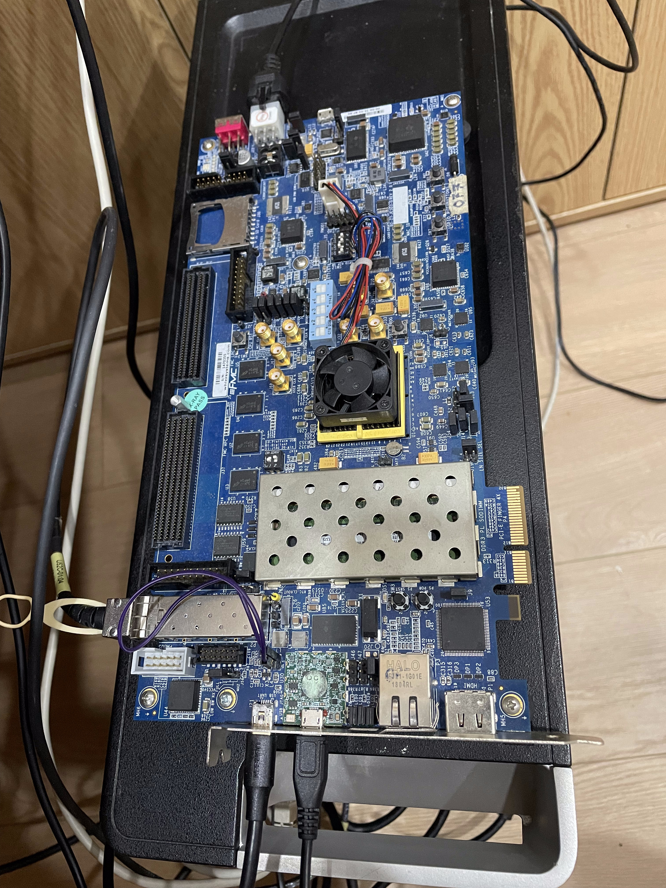
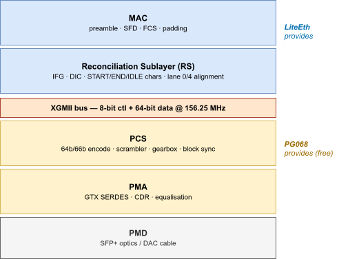
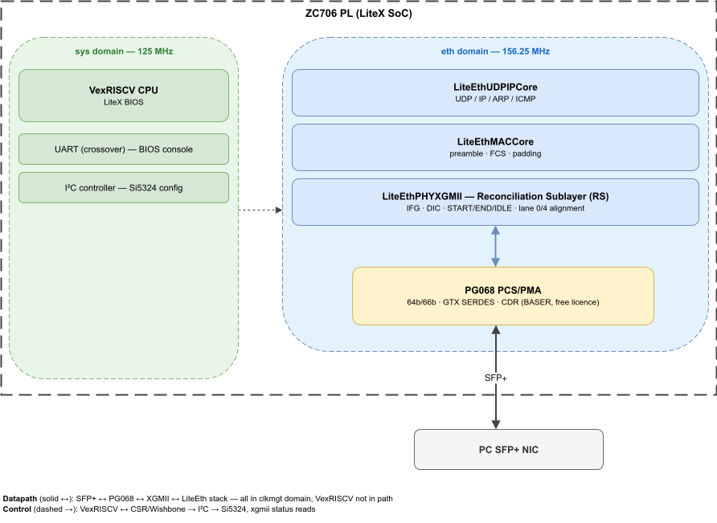
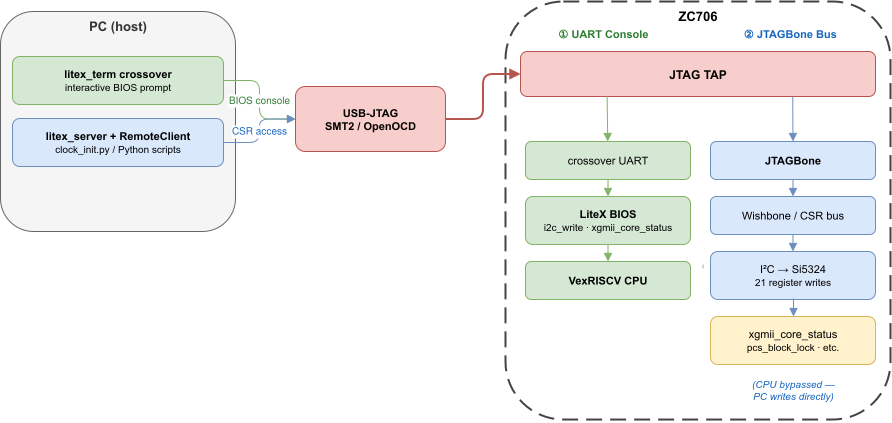
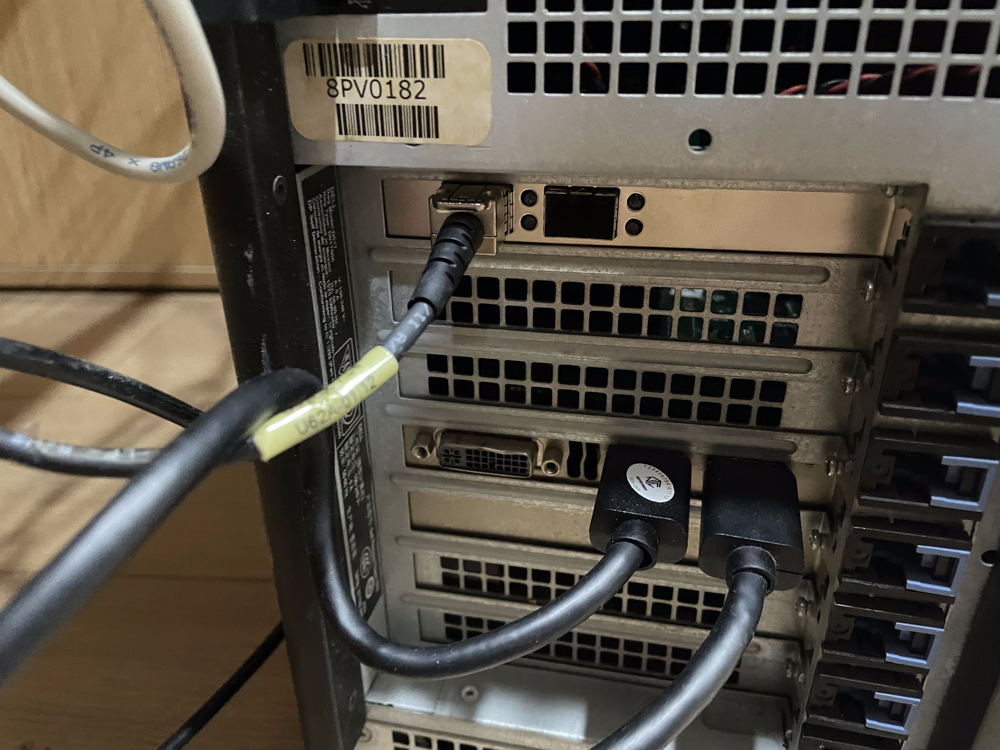
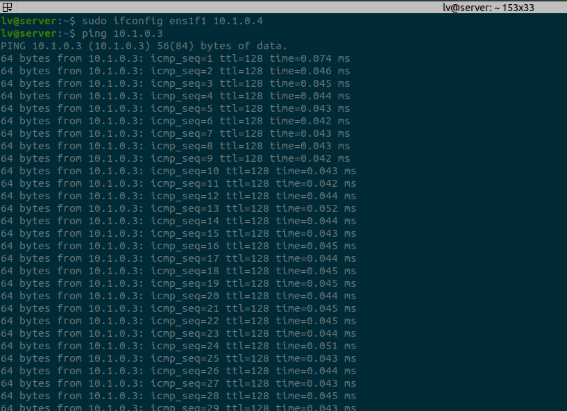
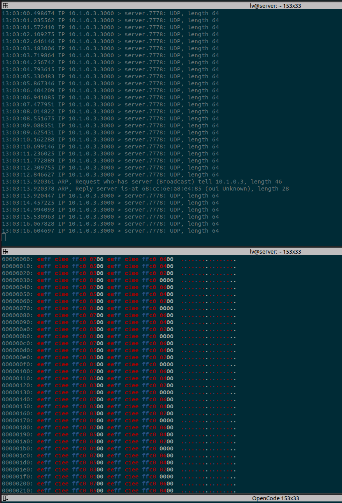

## Background

[The previous article](zc706-10g-one-board) brought up 10G Ethernet on the ZC706 using Xilinx's integrated `axi_10g_ethernet` IP (PG157). It works, but it carries a catch the original RTSYork README is upfront about: the integrated subsystem bundles a Ten-Gigabit MAC that requires a **design-linking evaluation licence**. That is fine for prototyping and pre-production development, but it cannot ship.

This article replaces that MAC with **LiteEth** — the BSD-licensed Ethernet stack from the LiteX project — while keeping Xilinx's **PG068 10G Ethernet PCS/PMA** for the serial side. The board, the SFP+ cage, and the Si5324 reference clock are all identical to the previous build. What changes is everything *above* the serial PHY: the MAC, the reconciliation logic, and the CPU that brings the link up are now open-source soft-logic running in the PL.



> **Source:** [`10g_zc706.py`](https://github.com/tieovi/zc706_10g_example) and `clock_init.py` — a LiteX SoC target plus a host-side clock bring-up script.

---

## Why the eval MAC is the blocker — and the PCS/PMA isn't

It is worth being precise about *which* piece of the previous design needed a licence, because it determines what we actually have to replace.

| IP | Function | Licence |
|---|---|---|
| **PG068** — `ten_gig_eth_pcs_pma` (BASER) | 64b/66b PCS + GTX PMA (SERDES) | **Free** |
| **PG072** — `ten_gig_eth_mac` | 10G MAC | Eval |
| **PG157** — `axi_10g_ethernet` | PG072 + PG068 bundled, AXI4-Stream up | Eval (because of the bundled MAC) |

The PCS/PMA layer — the part that does the hard analog work of 64b/66b coding, scrambling, and driving the GTX transceiver — is **already free** in BASER mode. The licence wall is the MAC. So the job is not "rebuild the 10G PHY"; it is "bring your own MAC, and keep talking to PG068 across the interface it already exposes."

That interface is **XGMII**.

---

## The XGMII layer boundary

10 Gigabit Ethernet has a clean architectural seam defined by IEEE 802.3, and it sits exactly where we need it:



The rule that makes this tractable is vendor-neutral:

> **If an IP's user-facing interface is XGMII, that IP is PCS + PMA only. The Reconciliation Sublayer is the user's responsibility.**

PG068 presents XGMII (`xgmii_txd/txc`, `xgmii_rxd/rxc`). It is byte-transparent: whatever 64 + 8 bits you hand it each cycle, it codes and ships; whatever it descrambles, it hands back. It knows nothing about frames, gaps, or alignment. Everything above the XGMII line — the RS *and* the MAC — is ours to provide.

LiteEth provides both:

- **`LiteEthPHYXGMII`** (`liteeth/phy/xgmii.py`) **is** the Reconciliation Sublayer. It is not glue logic — it enforces the ≥12-byte inter-frame gap, the deficit idle count, lane-0/lane-4 shifted starts, and per-byte control-character encoding that the standard requires. (It is ~700 lines of Migen for a reason.)
- **`LiteEthMACCore`** (`liteeth/mac/core.py`) is the MAC: preamble, FCS, padding.

So the swap is conceptually small: unplug the eval MAC from the XGMII bus, plug LiteEth's RS + MAC into it instead. PG068 doesn't know the difference.

---

## Architecture

The full design is a LiteX SoC. A **VexRISCV** soft-core runs the LiteX BIOS; LiteEth sits beside it as a peripheral. Crucially, the CPU is **not** in the packet datapath — it only configures and monitors the Ethernet logic over the CSR/Wishbone bus. The datapath itself runs entirely in PG068's clock domain.



Two independent clock domains. PG068 *generates* `coreclk_out` (156.25 MHz), which clocks the entire LiteEth stack. The 125 MHz CPU domain touches it only through synchronised CSR reads/writes — the CPU clock never drives a single byte of Ethernet traffic.

---

## Wiring PG068 to LiteEth

The Xilinx PCS/PMA is wrapped in a small Migen module, `XilinxXGMII`, that instantiates the IP and exposes its XGMII signals as a `Pads` object LiteEth understands.

```python
# XilinxXGMII — the PG068 instance (abbreviated to the XGMII-relevant ports)
self.specials += Instance(
    "ten_gig_eth_pcs_pma_0",
    i_refclk_p = refclk_pads.p,        # 156.25 MHz from Si5324
    i_refclk_n = refclk_pads.n,
    o_coreclk_out = self.coreclk,      # drives the clkmgt domain
    # XGMII RX:  PG068 → LiteEth
    o_xgmii_rxd = self.rx_data,        # 64-bit
    o_xgmii_rxc = self.rx_ctl,         #  8-bit control
    # XGMII TX:  LiteEth → PG068
    i_xgmii_txd = self.tx_data,
    i_xgmii_txc = self.tx_ctl,
    # serial side → SFP+
    i_rxp = rx_pads.p, i_rxn = rx_pads.n,
    o_txp = tx_pads.p, o_txn = tx_pads.n,
    o_core_status = self.core_status,  # bit 0 = pcs_block_lock
    # ... reset, DRP, status vector ...
)

# Expose XGMII + clock to LiteEth's PHY
class Pads:
    rx = ClockSignal("clkmgt"); rx_ctl = self.rx_ctl; rx_data = self.rx_data
    tx = ClockSignal("clkmgt"); tx_ctl = self.tx_ctl; tx_data = self.tx_data
self.pads = Pads()
```

`rx`/`tx` in that `Pads` class are *clock* signals, not data — both the same 156.25 MHz `clkmgt` clock that PG068 produces.

From there the stack is three connections:

```python
def add_xgmii(self):
    # 1. The PG068 wrapper
    self.submodules.xgmii = XilinxXGMII(self.crg.cd_sys, self.platform)

    # 2. The Reconciliation Sublayer, forced into the clkmgt domain
    self.submodules.xgmiiphy = ClockDomainsRenamer("clkmgt")(
        LiteEthPHYXGMII(self.xgmii.pads, self.xgmii.pads)
    )

    # 3. The full MAC + UDP/IP/ARP/ICMP stack, also in clkmgt
    self.submodules.teng_udp_core = ClockDomainsRenamer("clkmgt")(
        LiteEthUDPIPCore(
            self.xgmiiphy,
            0xAA1233445566,             # MAC address
            convert_ip("10.1.0.3"),     # board IP
            self.sys_clk_freq,
            dw=64,
        )
    )
    udp_port = self.teng_udp_core.udp.crossbar.get_port(3000, 64)
```

The `ClockDomainsRenamer("clkmgt")` wrappers are the important detail. The usual `add_ethernet()` helper would create its own `eth_tx`/`eth_rx` domains and the constraint scaffolding that goes with them. Here the PHY, MAC, and stack are placed directly in `clkmgt` — the domain PG068 already clocks — which keeps the timing picture to exactly two clocks and avoids a pile of spurious cross-domain warnings.

A clock-group constraint declares the CPU and refclk domains asynchronous, so the tools don't try to time paths between them:

```python
self.platform.toolchain.pre_placement_commands.add(
    "set_clock_groups "
    "-group [get_clocks -include_generated_clocks -of [get_nets {sys_clk}]] "
    "-group [get_clocks -include_generated_clocks refclk_p] "
    "-asynchronous",
    sys_clk=self.crg.cd_sys.clk,
)
```

---

## JTAG: one cable, two jobs

The ZC706's USB-JTAG (the Digilent SMT2, driven by OpenOCD) is the *only* host connection in this design — there is no separate USB-UART chip. LiteX multiplexes two independent transports over the FPGA's JTAG TAP, and you need to understand both because the Si5324 bring-up uses them:

| Role | LiteX core | Host tool | What you get |
|---|---|---|---|
| **UART console** | `uart_name="crossover"` | `litex_term crossover` | The interactive BIOS prompt — type `i2c_write`, `xgmii_core_status`, etc. |
| **Debug bridge (JTAGBone)** | `--with-jtagbone` | `litex_server --jtag` + `RemoteClient` | Direct read/write of any CSR / Wishbone address **from the PC**, with no CPU code running |



The payoff is **JTAGBone**: it lets a Python script on the PC configure the Si5324 over I²C by writing the LiteX I²C peripheral's registers across the Wishbone bus — the VexRISCV CPU executes nothing for this. The manual BIOS path and the scripted path are two front-ends to the *same* I²C peripheral, over the *same* cable:

- **Manual** — keystrokes → crossover UART → BIOS → I²C peripheral
- **Scripted** — `RemoteClient.write()` → JTAGBone → Wishbone → I²C peripheral

This is why the build needs both `--with-jtagbone` (the transport) and the `crossover` UART.

---

## Si5324 clock bring-up

As in the previous article, PG068 needs a 156.25 MHz reference and the ZC706's Si5324 must be programmed to produce it — program the bitstream alone and the link stays down. What's different here is *how* we program it: no Vitis, no bare-metal C, no recompilation. Just register writes, either typed or scripted.

The Si5324 sits behind the ZC706 I²C bus switch. Select its route at `0x74` first, then write 21 registers at `0x68`:

```python
# from clock_init.py
SI5324_REGS = {
    0x00: 0x54,  # FREE_RUN
    0x01: 0xE4, 0x02: 0x12, 0x03: 0x15, 0x04: 0x92,
    0x0A: 0x08, 0x0B: 0x40, 0x19: 0xA0,
    0x1F: 0x00, 0x20: 0x00, 0x21: 0x03,
    0x28: 0xC2, 0x29: 0x49, 0x2A: 0xEF,  # output divider → 156.25 MHz
    0x2B: 0x00, 0x2C: 0x77, 0x2D: 0x0B,
    0x2E: 0x00, 0x2F: 0x77, 0x30: 0x0B,
    0x88: 0x40,  # RST_REG / ICAL — trigger calibration
}
```

### Option A — type it in the BIOS

```
i2c_write 0x74 0x10 1 0x10
i2c_write 0x68 0x00 1 0x54
i2c_write 0x68 0x01 1 0xE4
i2c_write 0x68 0x02 1 0x12
i2c_write 0x68 0x03 1 0x15
i2c_write 0x68 0x04 1 0x92
i2c_write 0x68 0x0A 1 0x08
i2c_write 0x68 0x0B 1 0x40
i2c_write 0x68 0x19 1 0xA0
i2c_write 0x68 0x1F 1 0x00
i2c_write 0x68 0x20 1 0x00
i2c_write 0x68 0x21 1 0x03
i2c_write 0x68 0x28 1 0xC2
i2c_write 0x68 0x29 1 0x49
i2c_write 0x68 0x2A 1 0xEF
i2c_write 0x68 0x2B 1 0x00
i2c_write 0x68 0x2C 1 0x77
i2c_write 0x68 0x2D 1 0x0B
i2c_write 0x68 0x2E 1 0x00
i2c_write 0x68 0x2F 1 0x77
i2c_write 0x68 0x30 1 0x0B
i2c_write 0x68 0x88 1 0x40
xgmii_core_status
```

### Option B — script it over JTAGBone

```python
from litex import RemoteClient

bus = RemoteClient()        # → litex_server --jtag (JTAGBone)
bus.open()

i2c_write(bus, i2c_base, 0x74, 0x10, 1, 0x10)            # route to Si5324
for reg, val in SI5324_REGS.items():                     # each write:
    i2c_write(bus, i2c_base, 0x68, reg, 1, val)          #   JTAGBone → Wishbone → I²C, CPU bypassed

time.sleep(0.01)
status = bus.read(xgmii_core_status_addr)
print("PCS block lock:", "LOCKED" if status & 1 else "NOT LOCKED")
bus.close()
```

Both paths end at the same register. `clock_init.py` is just Option B wrapped with `csr.csv` parsing so it finds the I²C base and status addresses automatically.

---

## Build and bring-up

```bash
# 1. Build and load the bitstream
./10g_zc706.py --with-10g --with-jtagbone --csr-csv=csr.csv --build --load

# 2. Start the JTAG debug/console server (terminal 1)
litex_server --jtag --jtag-config openocd_xc7z_smt2-nc.cfg

# 3a. Bring up the clock from the PC (terminal 2)
python3 clock_init.py
#  ... or 3b. open the BIOS console and type the i2c_write sequence
litex_term crossover
```

The board carries two heartbeat LEDs that make the clock state visible at a glance:

- **LED0** blinks from the 125 MHz `sys` counter — the SoC is alive.
- **LED2** blinks from the 156.25 MHz `clkmgt` counter — **it only lights once the Si5324 is locked and PG068 is producing `coreclk_out`.** A dark LED2 means the clock bring-up hasn't taken.



---

## Verification

### PCS block lock

`xgmii_core_status` bit 0 is PG068's PCS block-lock flag — the link-up gate. After the Si5324 sequence it reads back `1`:

```
xgmii_core_status
xgmii_core_status = 0x00000001
```

If it stays `0`: confirm all 21 register writes landed (a missed bus-switch select at `0x74` is the usual culprit), check the JTAG link, and allow up to ~1 s for the GTX to lock.

### ICMP ping

With block lock up, the LiteEth stack is live. `LiteEthUDPIPCore` instantiates ARP and ICMP alongside UDP/IP, so the board answers ARP and replies to ping with no extra logic on our side — proof that the full open-source RS + MAC + IP path is carrying real frames end to end:



That round trip exercises everything we replaced: PG068 hands received bytes up the XGMII bus, LiteEth's RS strips the control characters and recovers the frame, the MAC checks it, the IP/ICMP core forms the echo reply, and the whole thing runs back out through the RS and PG068 to the wire — without a line of MAC RTL or firmware from Xilinx in the path.

### UDP data path

With ICMP working, the next step is pushing a real UDP payload. The design exposes port 3000 via the LiteEth crossbar; a short transmit loop on the ZC706 sends frames that arrive at the server's SFP+ NIC:



This confirms the full open-source datapath — VexRISCV → LiteEthUDPIPCore → LiteEthPHYXGMII → PG068 → wire — is carrying application-level data end to end.

---

## What's next

The link is up and answering ping; the natural follow-up is throughput. A future article will push UDP traffic through the LiteEth crossbar (the design already reserves port 3000) and measure what the open-source datapath sustains against the 10G line rate — plus where the design should live: PG068's `.xci` either vendored into the LiteEth PHY collection or carried in litex-boards.
