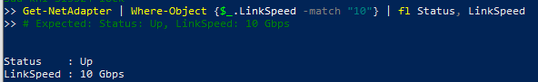
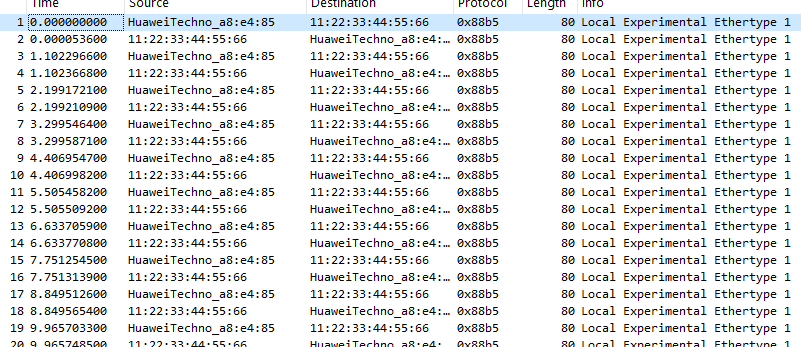
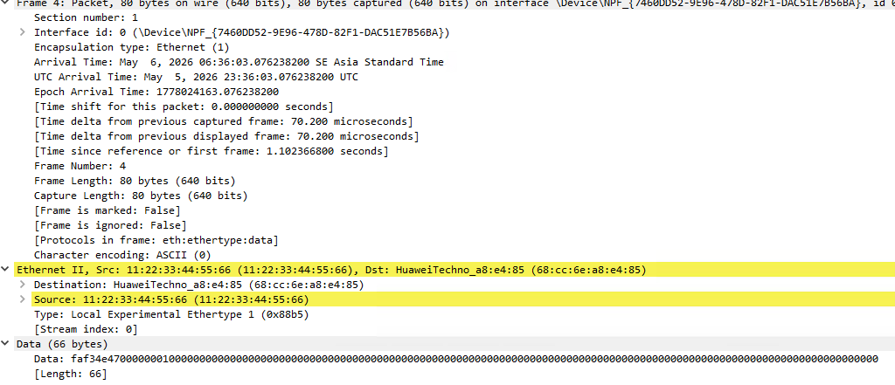

## Background

[RTSYork's ZC706 10G streaming project](https://github.com/RTSYork/zc706_10g_example) shows how to move 10-gigabit Ethernet frames through a Zynq FPGA fabric using Xilinx's AXI 10G Ethernet IP and a custom HLS reply kernel. The original setup uses **two ZC706 boards** connected back-to-back via an Active Optical Cable (AOC).

This article uses the slave/reply design with **one ZC706 and one PC**: the PC replaces the original transmitter board and runs Scapy to generate and receive frames. The board returns each frame with source and destination MAC addresses swapped, adds `0xAA` to the first two payload bytes, and echoes the rest of the payload. The migrated build scripts target Vivado 2024.1 and Vitis HLS 2024.1.

> **Source code:** [github.com/tieovi/zc706_10g_example](https://github.com/tieovi/zc706_10g_example)
> This repository is based on RTSYork's original project, with the slave hardware build updated for Vivado 2024.1 and Vitis HLS.

---

## Hardware

| Item | Notes |
|---|---|
| Xilinx ZC706 evaluation kit | Zynq XC7Z045 FFG900-2 |
| 10G SFP+ AOC cable | A link compatible with the SFP+ ports at both endpoints |
| PC with 10G SFP+ NIC | Required for a direct SFP+ AOC connection; a 10GBase-T NIC needs a different media path |

The ZC706's SFP/SFP+ socket (`P2` in the ZC706 user guide) connects directly to the PC's SFP+ NIC.

---

## Architecture

```
              P2 SFP+ / AOC
                    │
    ┌───────────────▼────────────────────────────────────────┐
    │                   ZC706 PL (FPGA Fabric)               │
    │                                                        │
    │  ┌───────────────────────┐  RX AXI4-S  ┌───────────┐   │
    │  │ axi_10g_ethernet_0    ├────────────►│ RX FIFO   │   │
    │  │ xilinx.com:ip:        │             └─────┬─────┘   │
    │  │ axi_10g_ethernet:3.1  │                   ▼         │
    │  │ integrated serial     │             ┌───────────┐   │
    │  │ Ethernet datapath     │             │ HLS Reply │   │
    │  │                       │             │ Kernel    │   │
    │  │                       │             └─────┬─────┘   │
    │  │                       │  TX AXI4-S        ▼         │
    │  │                       │◄────────────┌───────────┐   │
    │  └───────────────────────┘             │ TX FIFO   │   │
    │                                        └───────────┘   │
    │  Zynq PS: configures the Si5324 reference clock        │
    └────────────────────────────────────────────────────────┘
                    │
              PC SFP+ NIC / Scapy
```

**IP blocks:**

- **`axi_10g_ethernet_0`** - the generated block design instantiates `xilinx.com:ip:axi_10g_ethernet:3.1`, exposing serial SFP+ pins, reference-clock pins, AXI-Lite control, and AXI4-Stream receive/transmit interfaces.
- **RX/TX AXI4-Stream FIFOs** - packet-mode buffers between the Ethernet IP and the HLS processor.
- **HLS Reply Kernel** - a 64-bit AXI4-Stream processor that swaps Ethernet source/destination MAC addresses, increments the first two payload bytes by `0xAA`, and echoes the remaining payload.
- **Zynq PS application** - initializes the Si5324 over I2C so that the Ethernet IP receives its 156.25 MHz reference clock.

This is the topology in the linked migrated repository. It does **not** split the MAC and PCS/PMA into separate fabric-level cores with an exposed XGMII connection.

---

## Build

Clone the repository, then run the build from the `slave_hw` directory:

```bash
git clone https://github.com/tieovi/zc706_10g_example.git
```

Everything is scripted. From the repository root:

```bash
cd slave_hw
bash build_project.sh
```

The script runs three stages in order:

1. **HLS synthesis** (`cd hls && vitis_hls -f build.tcl`) — synthesises `main.cpp` into the `top` IP core and exports it to `hls/zc706_streaming_example/solution1/impl`.
2. **Project creation** (`vivado -mode batch -source project.tcl`) — creates the Vivado project, registers the HLS IP repository, imports constraints, instantiates the block design from `block_design.tcl`, and wraps the BD.
3. **Implementation** (`vivado -mode batch -source impl.tcl`) — runs synthesis, place-and-route, and bitstream generation.

The output bitstream is at:

```
slave_hw/zc706_10g_streaming/zc706_10g_streaming.runs/impl_1/blockdes_fixed_wrapper.bit
```

### Vivado version note

`block_design.tcl` contains a version guard at line 13:

```tcl
set scripts_vivado_version 2024.1
```

This fork targets Vivado 2024.1. If you migrate it to another Vivado release, regenerate the block-design Tcl after upgrading the IP and validate synthesis and implementation again; editing the version guard alone is not a migration.

---

## XSA Export and Vitis ELF

After bitstream generation, open `slave_hw/zc706_10g_streaming/zc706_10g_streaming.xpr` in Vivado and choose **File > Export > Export Hardware**, including the bitstream, to produce an XSA for Vitis.

In Vitis 2024.1 Unified:

1. **Create platform** from the exported XSA — the Zynq PS BSP is generated automatically.
2. **Create application** targeting the platform — use the bare-metal `Hello World` template as the starting point.
3. Replace `helloworld.c` with [`slave_sw/clock_init.c`](https://github.com/tieovi/zc706_10g_example/blob/master/slave_sw/clock_init.c). This application programs the Si5324 reference clock; the packet reply datapath is implemented in PL hardware.
4. Build and program: **Run → Run Configurations → Xilinx Application Debugger**.

---

## Si5324 Clock Initialisation

The 10G Ethernet datapath requires a 156.25 MHz reference. In this design, the ZC706 **Si5324 jitter-attenuating clock multiplier** is programmed from the Zynq PS before testing the link.

If you skip this step, the Ethernet link will not come up.

The Si5324 is behind the ZC706 I2C bus switch. The supplied application first selects the Si5324 route at bus-switch address `0x74`, then writes the Si5324 at address `0x68`:

```c
// Essential structure from slave_sw/clock_init.c.
// Use the complete file from the repository when building the application.
uint8_t route = (1 << 4);
i2c_write_await(&i2c_dev, 0x74, &route, 1);       // Route I2C to Si5324

i2c_write_single_reg(&i2c_dev, 0x68, 0x00, 0x54); // FREE_RUN
i2c_write_single_reg(&i2c_dev, 0x68, 0x01, 0xE4); // CK_PRIOR2, CK_PRIOR1
// ... remaining divider and clock-control registers ...
i2c_write_single_reg(&i2c_dev, 0x68, 0x88, 0x40); // RST_REG, ICAL
```

The full tested sequence is in [`slave_sw/clock_init.c`](https://github.com/tieovi/zc706_10g_example/blob/master/slave_sw/clock_init.c); it performs 21 Si5324 register writes after selecting the bus-switch route.

---

## IP License

The linked design uses Xilinx's integrated AXI 10G Ethernet IP. RTSYork's original README states that building the project requires a license for the Xilinx Ten-Gigabit MAC core. Check the applicable AMD/Xilinx license terms for your Vivado installation before using the design beyond evaluation or development.

Replacing the MAC with open-source **LiteEth** would require a revised architecture that provides a suitable 10G serial/PCS interface; that replacement is not implemented in the linked repository.

---

## Test: Scapy Ping-Pong

With the board programmed and the Vitis app running, connect the PC and run:

```python
from scapy.all import *

IFACE   = "eth2"                    # your 10G NIC interface name
DST_MAC = "00:0a:35:00:00:00"      # destination used in this test capture
MY_MAC  = get_if_hwaddr(IFACE)

def ping(n=10):
    for i in range(n):
        pkt = Ether(dst=DST_MAC, src=MY_MAC) / Raw(load=bytes([i, 0]))
        resp = srp1(pkt, iface=IFACE, timeout=1, verbose=0)
        if resp:
            payload = bytes(resp[Raw])
            print(f"[{i}] PONG received — payload[0]=0x{payload[0]:02x}")
        else:
            print(f"[{i}] timeout")

ping()
```

The HLS kernel swaps MACs so the response arrives back on the PC NIC, and it adds `0xAA` to the first two payload bytes (the ping→pong marker visible in Wireshark).

**Verify the link is up first** (PowerShell on Windows, or `ethtool eth2` on Linux):



Scapy output for a successful run:

![Scapy terminal: [0]–[9] PONG received](images/scapy_pong.png)

Wireshark confirms alternating TX/RX frames with the MAC flip:



Drilling into a PONG frame shows the source and destination MACs have swapped relative to the outgoing PING:



---

## Three Things That Surprised Me

**1. A PC can replace the original transmit board.**

The slave HLS processor only needs Ethernet frames at its AXI4-Stream input. Scapy is therefore a convenient way to send test packets and inspect the replies without building the RTSYork master-board design.

**2. The migrated repository keeps the original integrated Ethernet topology.**

The Vivado 2024.1 block design still contains one `axi_10g_ethernet` instance between the SFP+ pins and the AXI4-Stream packet-processing pipeline.

**3. Clock setup is part of bringing up the Ethernet link.**

Programming the bitstream is not sufficient: the PS application must select the Si5324 I2C route and program its clock registers before the 10G link can operate.

---

## What's Next

A follow-up article will investigate replacing the licensed MAC path with **LiteEth** and selecting an appropriate 10G PHY/PCS interface for the ZC706 SFP+ port.
